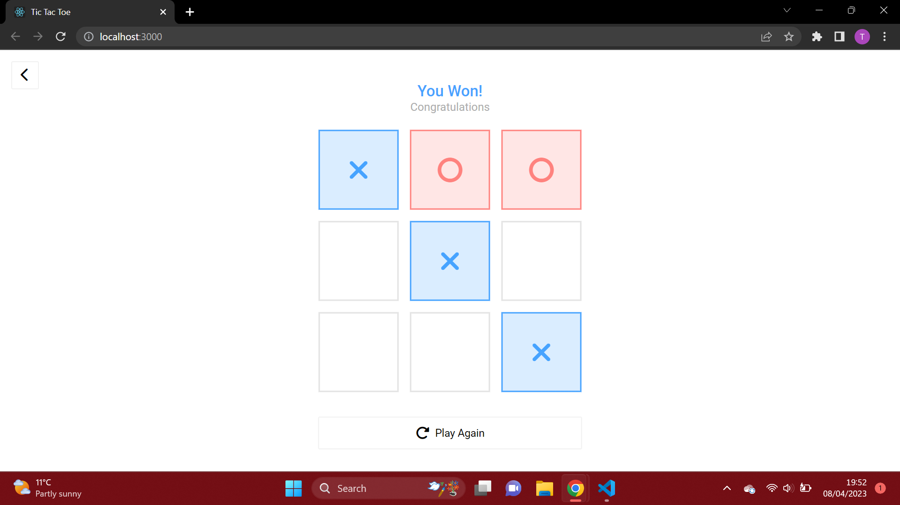

# Tic Tac Toe

## Contents

-   [Overview](#overview)
    -   [Built with](#built-with)
-   [How to use](#how-to-use)
    -   [How to play](#how-to-play)
-   [Acknowledgments](#acknowledgements)
-   [Contact](#contact)

## Overview





### Built with

-   [ReactJS](https://reactjs.org)
-   [SCSS](https://sass-lang.com)
-   [Font Awesome](https://fontawesome.com)

### Lessons learned

A **two-dimentional array** was used to store all the winning possible combinations. This array was then looped over in a function in order to *check whether a player had won*. 

```js
const possibleCombinations = [
	[0, 1, 2],
	[3, 4, 5],
	[6, 7, 8],
	[0, 3, 6],
	[1, 4, 7],
	[2, 5, 8],
	[0, 4, 8],
	[2, 4, 6],
];

export const checkForVictory = boxes => {
	for (let combition in possibleCombinations) {
		let count = 0;
		for (let box in boxes) {
			if (possibleCombinations[combition].includes(parseInt(box)))
				count++;
		}
		if (count > 2) return true;
	}
	return false;
};
```

## How to use

To clone and run this application, you'll need [Git](https://git-scm.com) and [Node.js](https://nodejs.org/en/download/) (which comes with [npm](http://npmjs.com)) installed on your computer. From your command line:

```bash
# Clone this repository
$ git clone https://github.com/tices0/web-games/tic-tac-toe

# Install dependencies
$ npm install

# Run the app
$ npm start
```

### How to play

Once the game has loaded, you will be shown the `menu`. In the top-left corner of the menu page, there will be the `dark mode toggle button`. At the bottom of the page, there are a set of buttons. Click on the buttons on top to choose player modes (`Single Player` or `Multiplayer`).

To **get started**, click on the `Start` button.

Incase you don't know, here is a [guide to playing tic tac toe](https://www.wikihow.com/Play-Tic-Tac-Toe).

At the end of each game, you will be given the option to **play again** by clicking on the `Play Again` button, or to go **back to the menu** by clicking on the arrow on the top-left corner of the page. From there you can change bring a friend and change player modes or change the page's colour theme to dark mode _(if you haven't already)_, and press `Start` to **play another game**.

_Screenshots of the game are shown in the [overview](#overview) (including the menu and gameplay in light and dark mode)._

## Acknowledgements

-   [Google Fonts](https://fonts.google.com/specimen/Roboto)
-   Inspiration from [Figma Design](<https://www.figma.com/file/oYIFNgo4LazHQPhLvf8Vd6/TIC-TAC-TOE---UI-Kit-(Community)?node-id=0-1&t=RQkuuTcCvoCvCAZD-0>)

## Contact

-   Github [tices0](https://github.com/tices0)
